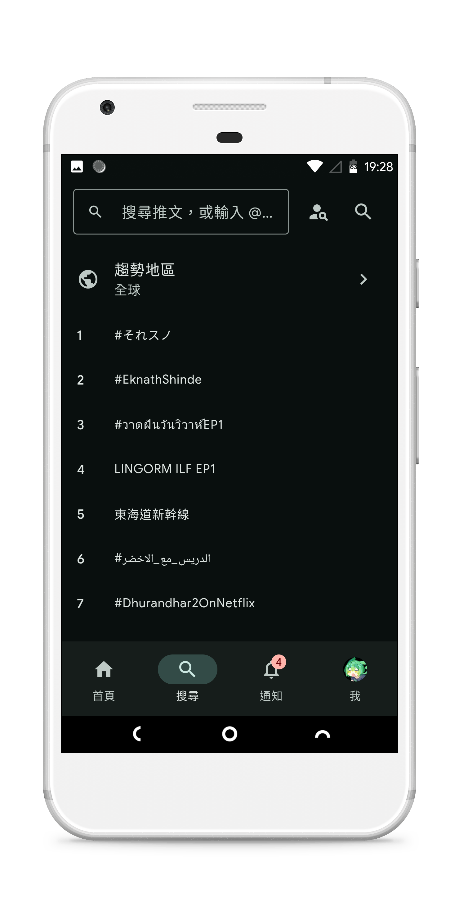
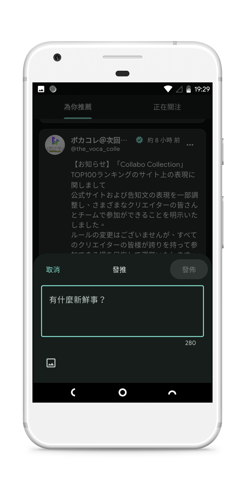
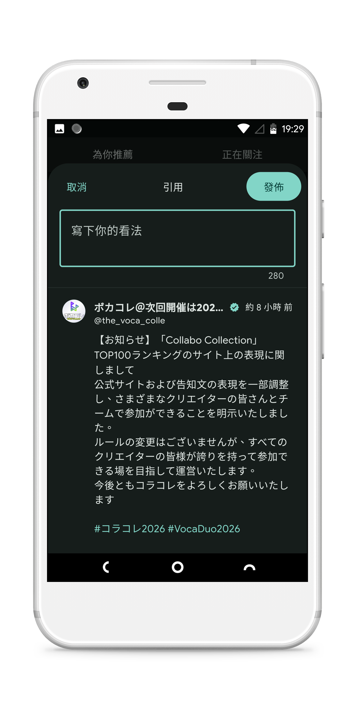
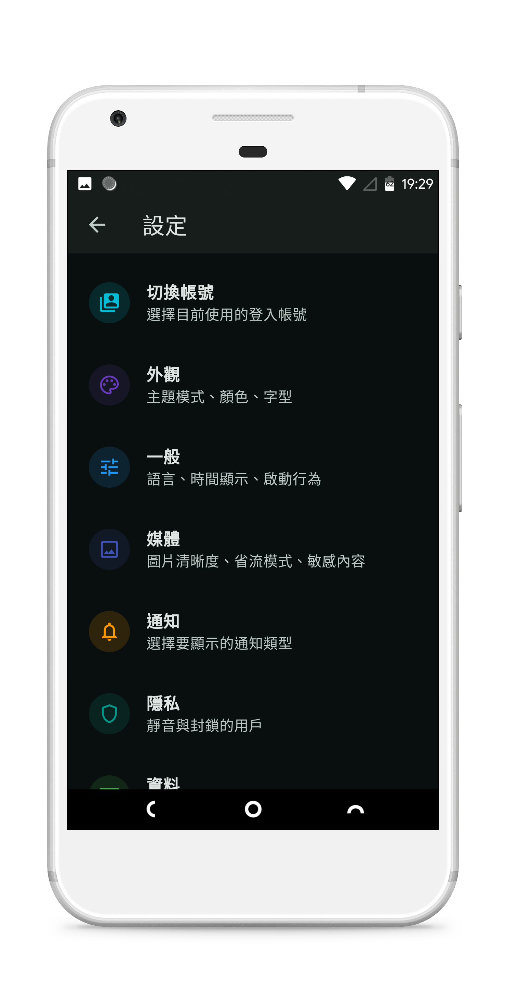

# Flaxtter

| 首頁時間軸 | 搜尋 |
|:---:|:---:|
|  |  |

| 推文詳情 | 引用推文 |
|:---:|:---:|
|  |  |

| 個人資料 | 通知 |
|:---:|:---:|
|  |  |

| 圖片檢視 | 設定 |
|:---:|:---:|
|  |  |

面向 **Linux** 與 **Android** 的第三方 Twitter/X 用戶端，以 Flutter 建構。透過 WebView 登入取得工作階段；API 層移植自 [Squawker](https://github.com/j-fbriere/squawker)。

本專案並非 X 官方產品，使用風險請自行評估。

## 特色

- **無追蹤器** — 不含第三方分析或遙測；登入資料僅儲存在本機
- **推文截圖儲存** — 將推文卡片匯出為圖片並儲存至相簿；Linux 可一併複製到剪貼簿
- **自訂外觀** — 可匯入自訂字型（TTF/OTF）、選擇強調色或 Material You 動態取色、調整文字大小與深淺色主題

## 功能

| 功能                      | 是否可用 |
| ----------------------- | ---- |
| 發推（文字與圖片）               | ✓    |
| 回覆與引用                   | ✓    |
| 轉推 / 取消轉推               | ✓    |
| 喜歡 / 取消喜歡               | ✓    |
| 書籤推文                    | ✓    |
| 刪除自己的推文                 | ✓    |
| 首頁時間軸（為你推薦 / 正在關注）      | ✓    |
| 搜尋推文、趨勢、hashtag         | ✓    |
| 使用者搜尋                   | ✓    |
| 個人資料（推文、回覆、媒體）          | ✓    |
| 粉絲與關注列表                 | ✓    |
| 關注 / 取消關注               | ✓    |
| 推文詳情與回覆串                | ✓    |
| 通知（全部 / 提及 / 認證）        | ✓    |
| 時間軸內圖片畫廊                | ✓    |
| 全螢幕圖片檢視（縮放、下載、分享）       | ✓    |
| 將推文儲存為圖片                | ✓    |
| 複製推文文字 / 連結、分享連結        | ✓    |
| 推文內影片播放                 | ✓    |
| 靜音與封鎖使用者列表              | ✓    |
| 介面語言（English、简体中文、繁體中文） | ✓    |
| 推播通知                    |      |
| 列表                      |      |
| 社群語音（Spaces）            |      |
| 社群（Communities）         |      |
| 應用內編輯個人資料               |      |
| 發推時上傳影片                 |      |

## 支援平台

| 平台      | 支援  |
| ------- | --- |
| Linux   | ✓   |
| Android | ✓   |

不會支援 Windows、macOS、iOS。

## 免責聲明

Flaxtter 為獨立開發的用戶端，與 X Corp. 無關，亦未獲其背書或贊助。過度或自動化使用可能違反 X 服務條款，或導致帳號受到限制。